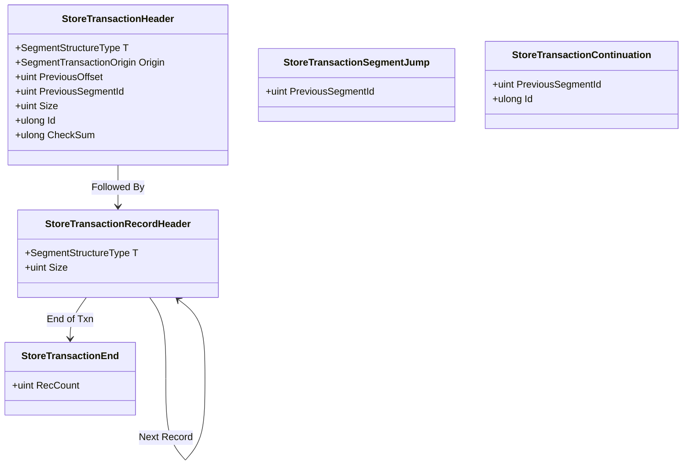

# MemorySegmentStore Transaction Implementation Plan

## Overview
This document outlines the implementation plan for adding full ACID transaction recording capabilities to `MemorySegmentStore`. The goal is to serialize transactions into memory segments (and eventually disk) with support for atomicity, consistency, and durability.

## 1. Data Structures & Layout

The transaction log is an append-only structure. Each transaction consists of a header, a sequence of records (bodies), and a footer.

### Transaction Structure


### Physical Layout (Happy Path)
```
[StoreTransactionHeader]
  [StoreTransactionRecordHeader] [Body Data]
  [StoreTransactionRecordHeader] [Body Data]
  ...
[StoreTransactionEnd]
```

### Physical Layout (Segment Overflow)
When a transaction exceeds the remaining space in `Segment A`:
**Segment A:**
```
[StoreTransactionHeader]
  [StoreTransactionRecordHeader] [Body Data]
  [StoreTransactionSegmentJump] -> Points to Segment B
[SealedSegmentEnd]
[SealedSegmentFooter] (At end of file)
```
**Segment B:**
```
[StoreTransactionContinuation] -> Links back to Segment A
  [StoreTransactionRecordHeader] [Body Data]
[StoreTransactionEnd]
```

## 2. Component Updates

### `MemorySegment`
We need to enhance `MemorySegment` to support random access writing (for patching headers) and persistence.

- **`WriteAt<T>(int offset, T value)`**: Allows writing a struct at a specific offset. Required for updating `StoreTransactionHeader.CheckSum` and `Size` after the body is processed.
- **`Flush()`**: Invokes `FlushViewOfFile` (for MMF) or ensures memory consistency.
- **`EnsureSpace(int size)`**: Helper to check if a write will fit.

### `TransactionChecksum`
- Already exists. Used to compute XXHash3 of the transaction stream.

## 3. Core Logic: `CommitTransaction`

The `CommitTransaction` method in `MemorySegmentStore` will be the coordinator.

### Workflow

1.  **Initialization**:
    -   Instantiate `TransactionChecksum`.
    -   Lock the store (ensure single writer).
    -   Capture `startSegmentId` and `startOffset` for the Header.

2.  **Write Header (Reservation)**:
    -   Check if `StoreTransactionHeader` fits in current segment.
    -   If not, seal and create new segment.
    -   Write a placeholder `StoreTransactionHeader` (with correct `Id`, `Origin`, etc., but 0 Checksum).
    -   Write to Checksum: `Header`.

3.  **Process Bodies**:
    -   Iterate through `IModifiedBodyStream`.
    -   For each Body:
        1.  **Serialize**: Get body data as `PinnedMemory` or Span.
        2.  **Space Check**: Calculate `RecordSize` (`StoreTransactionRecordHeader` + Body Length).
        3.  **Segment Jump Handling**:
            -   If `FreeSpace < RecordSize`:
                -   Write `StoreTransactionSegmentJump`.
                -   Seal current segment (`SealedSegmentEnd` + `SealedSegmentFooter`).
                -   Create/Add new `MemorySegment`.
                -   Write `StoreTransactionContinuation`.
        4.  **Write Record**:
            -   Write `StoreTransactionRecordHeader`.
            -   Write Body Data.
            -   Update Checksum with Header + Data.
        5.  **Track Stats**: Increment `recordCount`, accumulate `totalSize`.

4.  **Write End**:
    -   Handle Jump if needed (unlikely for just 8 bytes, but possible).
    -   Write `StoreTransactionEnd` with `recordCount`.
    -   Update Checksum.

5.  **Finalize (Patching)**:
    -   Finalize `CheckSum`.
    -   Use `MemorySegment.WriteAt` to update the *original* `StoreTransactionHeader` at `startOffset` in `startSegmentId`.
        -   Update `Size` (Total Txn Size).
        -   Update `CheckSum`.

6.  **Persistence (Two-Stage Commit)**:
    -   If `IsPersistent` is true:
        -   Call `Flush()` on `startSegment` and any subsequent segments used.
        -   This ensures durability before returning success.

## 4. Helper Classes

### `ReservationContext` (Internal)
A transient struct/class to hold state during the commit loop.
-   `long TransactionId`
-   `TransactionChecksum Checksum`
-   `int RecordCount`
-   `long TotalSize`
-   `List<int> InvolvedSegmentIds` (For flushing)

## 5. Implementation Steps

1.  **Refactor `MemorySegment`**: Add `WriteAt` and `Flush`.
2.  **Implement `CommitTransaction`**: Write the main logic loop.
3.  **Test Scenarios**:
    -   **Small Txn**: Fits in one segment.
    -   **Large Txn**: Triggers a jump (Set small segment size in tests).
    -   **Multi-Jump**: Txn spans 3+ segments.
    -   **Persistence**: Verify `Flush` is called.

## 6. Future Considerations (Not in this phase)
-   **Recovery**: Reading the log back and reconstructing state.
-   **Compaction**: Garbage collecting old segments.
